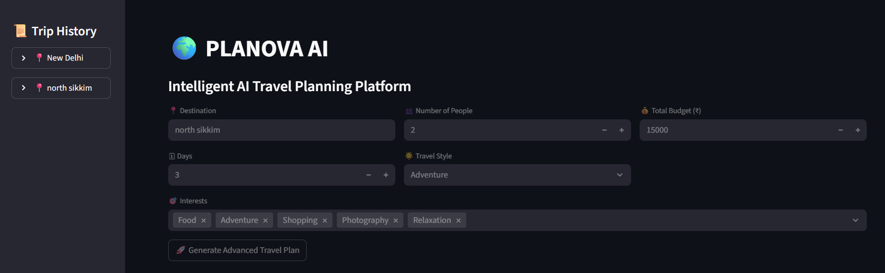
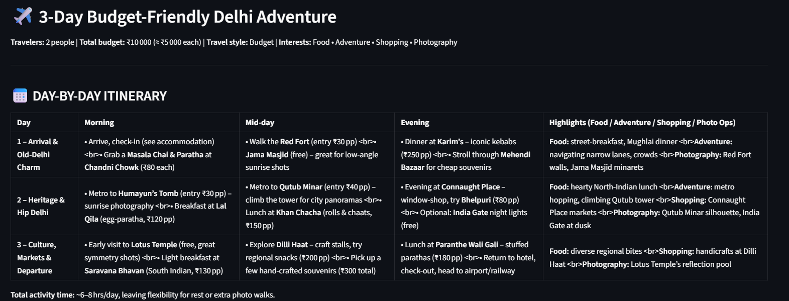
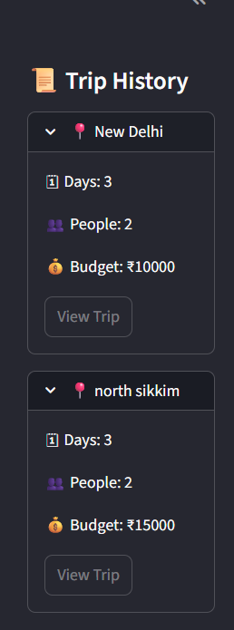

# 🌍 PLANOVA AI  
### Intelligent AI-Powered Travel Planning Platform

PLANOVA AI is a full-stack AI travel planning application that generates optimized, personalized travel itineraries using Large Language Models (LLMs).

It integrates real-time weather insights, dynamic destination imagery, Google Maps embedding, budget optimization, and PDF export functionality.

---

## 🚀 Features

- ✨ AI-generated structured travel itineraries
- 👥 Group-based cost optimization
- 💰 Per-person budget calculation
- 🌦 Real-time weather integration (OpenWeather API)
- 📸 Dynamic destination gallery (Unsplash API)
- 🗺 Google Maps location embedding
- 🏨 Smart accommodation recommendations
- 📦 PDF export functionality
- 📜 Sidebar trip history with metadata
- ⚡ Cached API responses for performance optimization

---

## 📸 Application Preview

### 🏠 Home Screen

---

### ✈️ Generated Travel Plan

---

### 🌄 Destination Gallery

---

### 🌦 Weather Integration

---

### 📜 Sidebar Trip History

---

## 🧠 Tech Stack

- **Frontend:** Streamlit  
- **Backend Logic:** Python  
- **LLM Provider:** Groq API (`openai/gpt-oss-120b`)  
- **Weather API:** OpenWeather  
- **Image API:** Unsplash  
- **PDF Generation:** ReportLab  
- **State Management:** Streamlit Session State  

---

## 🏗 Architecture Overview

1. User enters travel preferences
2. System calculates per-person budget
3. LLM generates optimized itinerary
4. Weather data influences suggestions
5. Unsplash provides contextual imagery
6. Google Maps embeds live location
7. Results are exportable as PDF
8. Trips are stored in session-based history

---

## 🔑 Environment Variables

Create a `.env` file:

